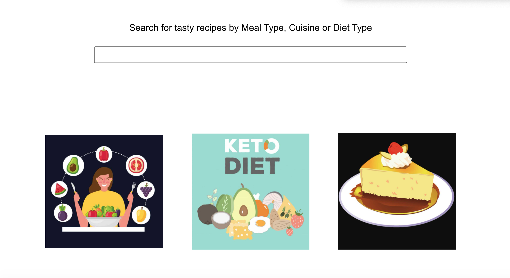
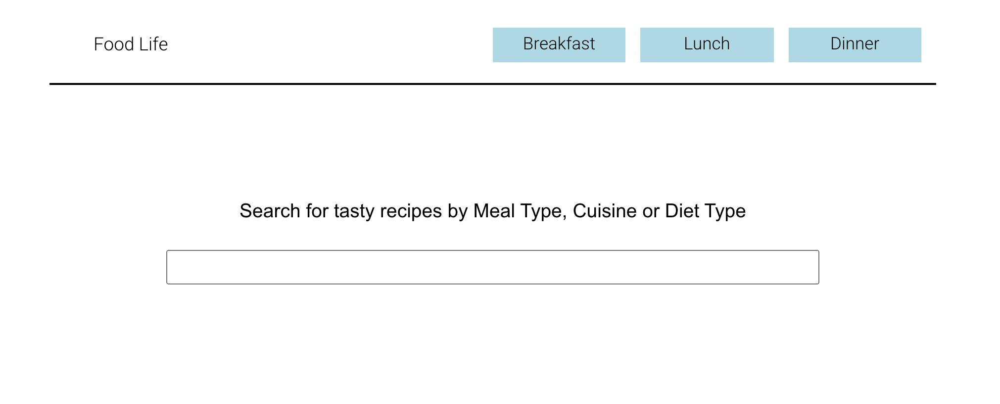
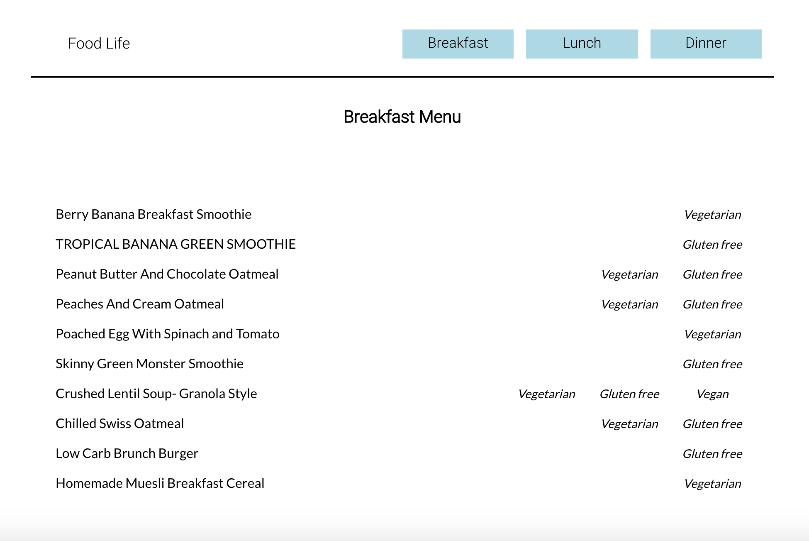

# General Assembly Project 2: Food Life - MERN project
Food Life is a web application to provide the selection of food in specified types.

## Timeframe: 3 days

## Goal:
To produce a full-stack web application using React, REST API, and CSS.
Technologies:
- React, lifecycle methods
- Get data from API
- Searching data from API
##  Project: Pair Programming
- Ren Mignogna: https://github.com/renato76 
## Deployed Link
https://life-food.herokuapp.com/
## Install dependencies
```
npm install
# run app
npm run dev
```
## Subjects
* Connect API,
* Route the components,
* Searching data from API
* Style components using CSS

## Code example
 
- Root app component.
 
This is a main component with exact routes.
```
class App extends Component {
 
 render() {
   return (
     <Fragment>
       <BrowserRouter>
         <Navbar />
         <div className="front-container">
        
        
           <Switch>
             <Route exact path="/" component={Home} />
             <Route exact path="/vegan" component={Vegan} />
             <Route exact path="/keto" component={Keto} />
             <Route exact path="/dessert" component={Dessert} />
             <Route exact path="/singular/:id" component={Singular} />
             <Route exact path="/dishtype/:type" component={DishType} />
           </Switch>
         </div>
       </BrowserRouter>
     </Fragment>
   )
 }
}
```
 
- Searchbar
 
This is a component to present the fetched REST API data as the result of given input. Visitors can search their favourite food dish by type.
```
class Home extends Component {
 
 state = {
   recipes: [],
   foodNames: null,
   searchNames: null
 }
 
 async componentDidMount() {
   const res = await getFoodName()
   return this.setState({ foodNames: res.data.results })
 }
 
 handleChange = (e) => {
   this.setState({ searchNames: e.target.value })
 
 }
  render() {
   if ( this.state.foodNames == null) return null
   const names = this.state.searchNames && this.state.foodNames.filter(element => [...element.title].toString().toLowerCase().includes([...this.state.searchNames].toString().toLowerCase()))
   return (
     <Fragment>
       <div className="home">
         <div className="searchingInput">
           <span> Search for tasty recipes by Meal Type, Cuisine or Diet Type </span>
           <input onChange = {e =>this.handleChange(e)} type="text" name="searchNames" className="home-search" />
           {
             names && <div className="foodlist">{names.map(name =>
               <Link key={name.id} to={`/singular/${name.id}`} >{ name.title }</Link>
             )}</div>
           }
          
         </div>
        
         <div className="home-icon home-one"><Link to="/vegan"></Link></div>
        
         <div className="home-icon home-two"><Link to="/keto"></Link></div>
        
         <div className="home-icon home-three"><Link to="/dessert"></Link></div>
      
       </div>
     </Fragment>
   )
 }
}
export default Home
```
 
## License
* version 1.0.0
* license MIT
* created by Puja
## Development process
The point was concentrated to present fetched data to the user.
The user interface was created using CSS styles.

Data has been split into types on different routes.
e.g. Breakfast route

Routes include the list of elements with the single link address to the item.

## Challenges
The challenge was to manage the data flow from API as the data was really nested. And also working in pairs, we were encountered with GIT issues i.e push and pull (data). Use lifecycle method was a bit tricky compared with the REST API.
## Wins
Complete the data management in 3 days timeframe.
 
## Future Development
 
I would like to put components styling, handle events animation.

## Key Learnings
It is really important to plan and wireframe the ideas correctly so that we don't waste time or get confused in the middle of the project. Communication is really important while working as a pair. Dividing work with the strength level is always a good point. 
 


